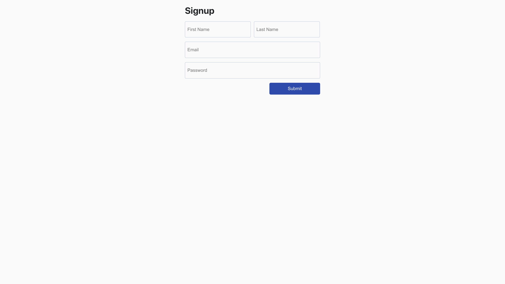

## Signup Form

The application is used for signup to Raisely API, built with React, JavaScript, and CSS.

## Form Screen Shot

## Installation and Setup

Clone down this repository. You will need `node` and `npm` installed globally on your machine.

Installation:

`yarn install` or `npm install`

To Runs the app in the development mode:  

`yarn start` or `npm start`

To Run Test:  

`yarn test` or `npm test`

To view it in the browser:

Open [http://localhost:3000](http://localhost:3000)
